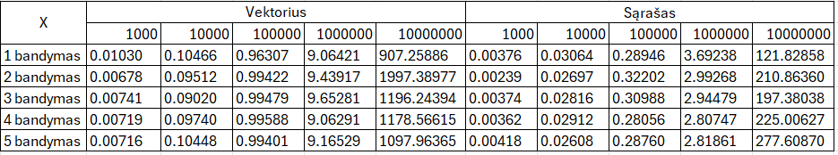
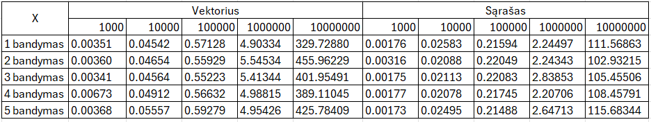

#Studentų galutinio balo apskaičiavimo programa. (v1.0 versija)

#Ši programa skirta apskaičiuoti galutiniams balams, įvedant arba nuskaitant iš failo studento vardą, pavardę, namų darbų rezultatus bei egzamino balą.

#Galutinis balas skaičiuojamas tokia formule: **Galutinis = 0.4 * vidurkis + 0.6 * egzaminas** (Kai reikia galutinio balo medianos pavidalu tai tiesiog vietoj vidurkio įstatoma mediana)

#Norint naudotis programa, reikia atlikti šiuos veiksmus:
- Pasirinkti, ar norite sugeneruoti failus(taip/ne).

Jei pasirinksite, kad norite sugeneruoti, tuomet failai bus sukurti ir išvedime bus rodomas failų kūrimo laikas.
  
- Atsakyti programai, ar norite įvesti studentų duomenis ar nuskaityti juos iš failo(ivesti/nuskaityti).
- Pasirinkti norimo naudoti konteinerio tipą (1 - vector, 2 - list).
- Pasirinkti rūšiavimo kritetijų (1 - pagal vardą, 2 - pagal pavardę, 3 - pagal galutinį balą).
  
Jei pasirenkate nuskaityti, tai programa tiesiogiai nuskaitys failą, naudodama pasirinktą konteinerio tipą, surušiuos studentus pagal galutinį balą(pagal vidurkį) į dvi grupes:Vargšiukai(galutinis balas < 5) ir Kietiakiai(galutinis balas >= 5), surušiuos pagal pasirinktą kriterijų ir išves į du naujus failus. 
  
  **Jei pasirenkate įvesti, tuomet toliau reikes atlikti šiuos veiksmus:**
- Įvesti studentų skaičių.
- Pasirinkti norimą naudoti konteinerį.
- Įvesti studento vardą ir pavardę.
- Pasirinkti ar namų darbų ir egzamino rezultatus reikia generuoti atsitiktinai(taip/ne).
- Atsakyti programai, ar žinai koks yra namų darbų skaičius(taip/ne).
- Įvesti namų darbų skaičių.
- Įvesti namų darbų visus rezultatus(10-balėje sistemoje).
- Galiausiai įvesti egzamino balą.
Išvedime prie studento duomenų matysite ir objekto saugojimo atmintyje adresą.

**#Sistemos parametrai**
1. Procesorius(CPU):
- Modelis: AMD Ryzen 5 3500U
- Dažnis: 2.10 GHz
- Branduoliai: 4
- Gijos: šiuo metu sistemoje yra apie 3700 gijų,taciau skaičius gali kisti. 
- Cache atmintis: L1(384 KB), L2(2.0 MB), L3(4.0 MB)

2. Operatyvioji atmintis(RAM):
- Talpa: 8 GB
- Dažnis: 2400 MHz
- Naudojami lizdai: 2 iš 2

3. Kietasis diskas(HDD/SSD):
- Tipas: SSD
- Talpa: 239 GB

**Studentų dalijimo į dvi kategorijas strategijų bandymai**

1 strategija: Bendro studentai konteinerio (vector ir list tipų) skaidymas (rūšiavimas) į du naujus to paties tipo konteinerius: "vargšiukų" ir "kietiakų". Tokiu būdu tas pats studentas yra dvejuose konteineriuose: bendrame studentai ir viename iš suskaidytų (vargšiukai arba kietiakai). 

Pastaba. Apskaičiuotas vidutinis laikas(sekundėmis), kuris leidžia greičiau ir lengviau pastebėti skirtumus, kai naudojami skirtingi konteinerių tipai(vector ir list).
| Įrašų dydis | Vektorius   | Sąrašas    |
|-------------|-------------|------------|
| 1000        | 0.008       | 0.004      |
| 10000       | 0.099       | 0.028      |
| 100000      | 0.988       | 0.298      |
| 1000000     | 9.277       | 3.051      |
| 10000000    | 1275.484    | 206.538    |

Rezultatas:kaip sparta priklauso nuo tipo?

2 strategija: Bendro studentų konteinerio (vector ir list) skaidymas (rūšiavimas) panaudojant tik vieną naują konteinerį: "vargšiukai". 

Pastaba.Apskaičiuotas vidutinis laikas(sekundėmis), kuris leidžia greičiau ir lengviau pastebėti skirtumus.
| Įrašų dydis | Vektorius   | Sąrašas    |
|-------------|-------------|------------|
| 1000        | 0.011       | 0.002      |
| 10000       | 0.048       | 0.023      |
| 100000      | 0.568       | 0.218      |
| 1000000     | 5.161       | 2.436      |
| 10000000    | 400.508     | 108.819    |

Rezultatas:

Išvados:Palyginus pagal 1 ir 2 strategias gautus vidutinius dalijimo laikus esant tam tikram duomenų kiekiui, pastebėta, kad .....

Todėl toliau pasirinkus greičiau veikiančią strategiją -***** , įvykdysime 3 strategiją.

3 strategija: Bendro studentų konteinerio (vector ir list) skaidymas (rūšiavimas) panaudojant greičiausiai veikianti 1 arba 2 strategiją  įtraukiant į ją "efektyvius" darbo su konteineriais metodus.

#Efektyvumo tyrimai ir rezultatai: 
- Laiko efektyvumas:
1. Programa greitai apdoroja nuskaitytus studentų duomenis, tačiau kai yra didesnis studentų skaičius, pastebimas ilgesnis laukimo laikas, kol programa pateikia rezultatus. Galima pamatyti,kad didėjant failo dydžiui, apdorojimo laikas ilgėja, ypač nuskaitymo ir rūšiavimo etapuose. Rūšiavimo laikas augo dramatiškai nuo 0.01251s(1000 įrašų) iki 544.98148s(10000000 įrašų), o dalijimo laikas taip pat didėjo, bet išlieka gerokai greitesnis už rūšiavimo laiką. Bendras testo laikas nuosekliai didėja, atspindėdamas procesų sudėtingumą.
2. Kai buvo pasirinkta įvesti duomenis, tuomet programoje įvedant mažą studentų skaičių(tarkim du), ji apdoroja įvestus studentų duomenis gana greitai. Tačiau kai yra didesnis studentų skaičius(tarkim dešimt), įvedimas užtrunka žymiai ilgiau.
3. Failų kūrimo efektyvumas mažėja didėjant duomenų kiekiui.

Pastaba. Nors kiekvieno testavimo metu rezultatai gali nežymiai skirtis dėl atsitiktinių veiksnių, bendros laiko tendencijos išlieka tos pačios.

- Atminties efektyvumas: programoje naudojamos struktūros std::vector ir std::list, kurios leidžia efektyviai saugoti ir tvarkyti studentų namų darbų rezultatus. Užtikrinama, kad programa galėtų veikti su dideliu studentų skaičiumi.
  
- Vartotojo sąsajos paprastumas: programoje yra leidžiama lengvai įvesti duomenis ir gauti rezultatus. Aiškiai nurodyti visi privalomi įvedimai ir rezultatas gaunamas greitai.

#Rezultatas - Iš įvesties studentų duomenys nuskaitomi teisingai ir programa išveda studentų vardus, pavardes ir galutinį balą(medianos ir vidurkio pavidalu). Taip pat kai nuskaitomas failas, studentai surušiuojami į dvi grupes ir išvedami į naujus failus. Išvedime rodoma programos veikimo greičio analizė.

#Naudotos bibliotekos:
- `<iostream>`
- `<iomanip>`
- `<string>`
- `<vector>`
- `<algorithm>`
- `<random>`
- `<fstream>`
- `<sstream>`
- `<chrono>`
- `<list>`
