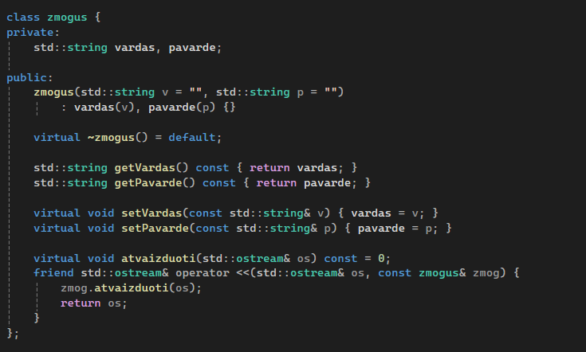
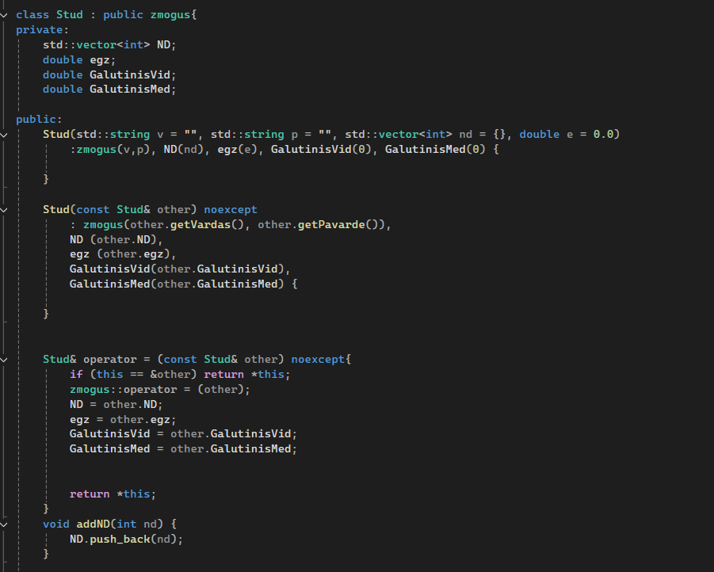
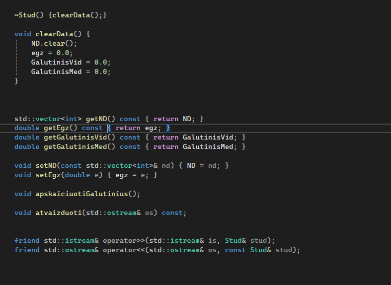

#Studentų galutinio balo apskaičiavimo programa. **(v1.5 versija)**

**#v1.5 verisjos tikslas -  Vietoje turimos Studentas klasės sukurti dvi: bazinę (abstrakti) klasę,
 skirtą bendrai aprašyti žmogų ir tuomet iš jos išvestinę (derived) klasę - Studentas.

#Ši programa skirta apskaičiuoti galutiniams balams, įvedant arba nuskaitant iš failo studento vardą, pavardę, namų darbų rezultatus bei egzamino balą.

#Galutinis balas skaičiuojamas tokia formule: **Galutinis = 0.4 * vidurkis + 0.6 * egzaminas** (Kai reikia galutinio balo medianos pavidalu tai tiesiog vietoj vidurkio įstatoma mediana)

**#Norint naudotis programa, reikia atlikti šiuos veiksmus:**
- Pasirinkti, ar norite sugeneruoti failus(taip/ne).

Jei pasirinksite, kad norite sugeneruoti, tuomet failai bus sukurti ir išvedime bus rodomas failų kūrimo laikas.
  
- Atsakyti programai, ar norite įvesti studentų duomenis ar nuskaityti juos iš failo(ivesti/nuskaityti).
- Pasirinkti dalijimo į dvi kategorijas strategiją (1 - pirmoji, 2 - antroji, 3 - trečioji).
- Pasirinkti norimo naudoti konteinerio tipą (1 - vector, 2 - list).
- Pasirinkti rūšiavimo kritetijų (1 - pagal vardą, 2 - pagal pavardę, 3 - pagal galutinį balą).
  
Jei pasirenkate nuskaityti, tai programa tiesiogiai nuskaitys failą, naudodama pasirinktą konteinerio tipą, surušiuos studentus pagal galutinį balą(pagal vidurkį) į dvi grupes:Vargšiukai(galutinis balas < 5) ir Kietiakiai(galutinis balas >= 5), surušiuos pagal pasirinktą kriterijų ir išves į du naujus failus. 
  
  **Jei pasirenkate įvesti, tuomet toliau reikes atlikti šiuos veiksmus:**
- Įvesti studentų skaičių.
- Pasirinkti norimą naudoti konteinerį.
- Įvesti studento vardą ir pavardę.
- Pasirinkti ar namų darbų ir egzamino rezultatus reikia generuoti atsitiktinai(taip/ne).
- Atsakyti programai, ar žinai koks yra namų darbų skaičius(taip/ne).
- Įvesti namų darbų skaičių.
- Įvesti namų darbų visus rezultatus(10-balėje sistemoje).
- Galiausiai įvesti egzamino balą.
Išvedime prie studento duomenų matysite ir objekto saugojimo atmintyje adresą.

**#Abstrakčios klasės Žmogus realizavimas**

Rezultatas: Turi bendrą informaciją apie žmogų (vardas, pavardė). Ji negali būti naudojama tiesiogiai objektų kūrimui. Vietoj to, ji veikia kaip bazinė klasė, kuria remiasi kitos išvestinės klasės. Mūsų atvėju - **Studentas**. virtual ~zmogus() - destruktorius yra virtualus, nes klasė paveldima. virtual void atvaizduoti() - tai grynai virtuali funkcija, todėl kiekviena išvestinė klasė privalo ją įgyvendinti. Tai leidžia naudoti polimorfizmą, nes funkcijos implementacija priklauso nuo objekto tipo.

**#Studento klasė išvestinė (derived) iš Žmogaus, kuri palaiko 1.2 versijoje realizuotą trejų metodų taisyklę.**

Rezultatas: Klasė Studuentas paveldi bazinę klasę **žmogus** ir įgyvendina jos metodus. Ji prideda studento specifinius duomenis. Ši klasė privalo įgyvendinti visus grynai virtualius metodus iš bazinės klasės. Taip pat ji įgyvendina metodą atvaizduoti(), kad galėtų parodyti visą informaciją apie studentą.

Išvadėlė: Žmogus klasė suteikia bendrą šabloną, o Studentas prideda konkrečius duomenis ir funkcionalumą.

**#Perdengtų metodų veikimas.**

#Duomenų įvestis: 
- Rankiniu būdu - Vartotojas gali įvesti duomenis klaviatūra, kai programa naudoja std::cin srautą. Naudojant operatorių operator>>, programa leidžia įvesti vardą, pavardę, namų darbų rezultatus, egzamino balą.
- Automatiniu - Duomenys gali būti įvedami automatiškai pagal tam tikrą procesą(įvesti iš anksto paruoštus duomenis)
- Iš failo - Duomenys gali būti nuskaityti iš failo naudojant std::ifstream srautą. Perdengtas  operator>> metodas leidžia nuskaityti duomenis iš failo, kurio turinys turi būti struktūrizuotas pagal tam tikrus reikalavimus ir užpildyti Stud objekto laukus.

#Duomenų išvestis 
- Į ekraną - Duomenys atspausdinami ekrane naudojant std::cout. Su perdengtu operatoriumi operator<< studento informacija bus gražiai suformuluota ir pateikta vartotojui tiesiogiai ekrane.
- Į failą - Duomenys įrašomi į failą naudojant std::ofstream srautą. Operatorius operator<< užtikrina, kad studento duomenys būtų įrašyti į failą, kurį vėliau vartotojas gali peržiūrėti.

Išvadėlė: Perdengti metodai (operator>> ir operator<<) leidžia paprastai atlikti duomenų įvedimą ir išvedimą tiek interaktyviai su vartotoju, tiek automatiškai.
Operator>> leidžia nuskaityti duomenis (rankiniu būdu, automatiniu būdu arba iš failo), o operator<< padeda išvesti duomenis ekrane arba į failą.

Išvadėlė: "Rule of three" taisyklė užtikrina, kad klasės objektai, kurie dirba su dinaminiais ištekliais, būtų teisingai kopijuojami, priskiriami ir sunaikinami, taip išvengiant atminties nutekėjimo ir kitų valdymo klaidų.

#Efektyvumo tyrimai ir rezultatai: 
- Laiko efektyvumas:
1. Programa greitai apdoroja nuskaitytus studentų duomenis, tačiau kai yra didesnis studentų skaičius, pastebimas ilgesnis laukimo laikas, kol programa pateikia rezultatus. Galima pamatyti,kad didėjant failo dydžiui, apdorojimo laikas ilgėja, ypač nuskaitymo ir rūšiavimo etapuose. Rūšiavimo laikas augo dramatiškai nuo 0.01251s(1000 įrašų) iki 544.98148s(10000000 įrašų), o dalijimo laikas taip pat didėjo, bet išlieka gerokai greitesnis už rūšiavimo laiką. Bendras testo laikas nuosekliai didėja, atspindėdamas procesų sudėtingumą.
2. Kai buvo pasirinkta įvesti duomenis, tuomet programoje įvedant mažą studentų skaičių(tarkim du), ji apdoroja įvestus studentų duomenis gana greitai. Tačiau kai yra didesnis studentų skaičius(tarkim dešimt), įvedimas užtrunka žymiai ilgiau.
3. Failų kūrimo efektyvumas mažėja didėjant duomenų kiekiui.

Pastaba. Nors kiekvieno testavimo metu rezultatai gali nežymiai skirtis dėl atsitiktinių veiksnių, bendros laiko tendencijos išlieka tos pačios.

- Atminties efektyvumas: programoje naudojamos struktūros std::vector ir std::list, kurios leidžia efektyviai saugoti ir tvarkyti studentų namų darbų rezultatus. Užtikrinama, kad programa galėtų veikti su dideliu studentų skaičiumi.
  
- Vartotojo sąsajos paprastumas: programoje yra leidžiama lengvai įvesti duomenis ir gauti rezultatus. Aiškiai nurodyti visi privalomi įvedimai ir rezultatas gaunamas greitai.

#Rezultatas - Iš įvesties studentų duomenys nuskaitomi teisingai ir programa išveda studentų vardus, pavardes ir galutinį balą(medianos ir vidurkio pavidalu). Taip pat kai nuskaitomas failas, studentai surušiuojami į dvi grupes ir išvedami į naujus failus. Išvedime rodoma programos veikimo greičio analizė. 

##Visų iki šios v1.5 versijos atliktų releasu apibendrinimas:
- 1 ir 2 releasai(v.pradinė ir v0.1) realizuoja programa pagal aprašytus užduoties reikalavimus nuskaito vartotojų įvedamus reikiamus duomenis ir pateikia studentu duomenis.
- 3 releasas(v0.2) - Programa patobulinta, kad generuotu failus, surusiuotu nuskaitytus duomenis ir įrašytų į atskirus failus.
- 4 releasas(v0.3) -  Išmatuojama patobulintos v0.2 realizacijos veikimo spartą priklausomai nuo naudojamo vieno iš dvejų konteinerių(vector ir list)
- 5 releasas(v1.0) - Optimizuota studentų rūšiavimo (dalijimo) į dvi kategorijas ("vargšiukų" ir "kietiakų") realizacija (v0.3)
- 6 realisas(v1.1) - Perėjimas iš struktūros į klasę.
- 7 realisas(v1.2) - Realizuoti visi reikiami "Rule of three" ir įvesties/išvesties operatoriai turimai Studentas klasei. 

#Naudotos bibliotekos:
- `<iostream>`
- `<iomanip>`
- `<string>`
- `<vector>`
- `<algorithm>`
- `<random>`
- `<fstream>`
- `<sstream>`
- `<chrono>`
- `<list>`

