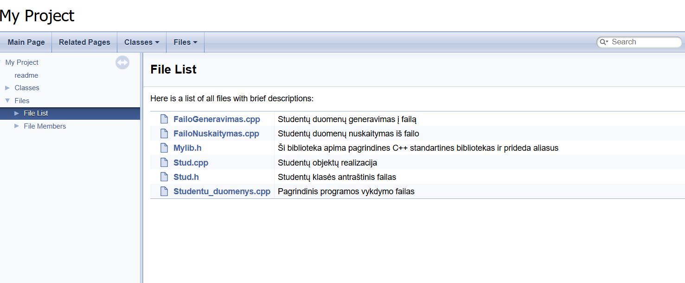

#Studentų galutinio balo apskaičiavimo programa. **(v2.0 versija)**

#Ši programa skirta apskaičiuoti galutiniams balams, įvedant arba nuskaitant iš failo studento vardą, pavardę, namų darbų rezultatus bei egzamino balą.

#Galutinis balas skaičiuojamas tokia formule: **Galutinis = 0.4 * vidurkis + 0.6 * egzaminas** (Kai reikia galutinio balo medianos pavidalu tai tiesiog vietoj vidurkio įstatoma mediana)

**#Norint naudotis programa, reikia atlikti šiuos veiksmus:**
- Pasirinkti, ar norite sugeneruoti failus(taip/ne).

Jei pasirinksite, kad norite sugeneruoti, tuomet failai bus sukurti ir išvedime bus rodomas failų kūrimo laikas.
  
- Atsakyti programai, ar norite įvesti studentų duomenis ar nuskaityti juos iš failo(ivesti/nuskaityti).
- Pasirinkti dalijimo į dvi kategorijas strategiją (1 - pirmoji, 2 - antroji, 3 - trečioji).
- Pasirinkti norimo naudoti konteinerio tipą (1 - vector, 2 - list).
- Pasirinkti rūšiavimo kritetijų (1 - pagal vardą, 2 - pagal pavardę, 3 - pagal galutinį balą).
  
Jei pasirenkate nuskaityti, tai programa tiesiogiai nuskaitys failą, naudodama pasirinktą konteinerio tipą, surušiuos studentus pagal galutinį balą(pagal vidurkį) į dvi grupes:Vargšiukai(galutinis balas < 5) ir Kietiakiai(galutinis balas >= 5), surušiuos pagal pasirinktą kriterijų ir išves į du naujus failus. 
  
  **Jei pasirenkate įvesti, tuomet toliau reikes atlikti šiuos veiksmus:**
- Įvesti studentų skaičių.
- Pasirinkti norimą naudoti konteinerį.
- Įvesti studento vardą ir pavardę.
- Pasirinkti ar namų darbų ir egzamino rezultatus reikia generuoti atsitiktinai(taip/ne).
- Atsakyti programai, ar žinai koks yra namų darbų skaičius(taip/ne).
- Įvesti namų darbų skaičių.
- Įvesti namų darbų visus rezultatus(10-balėje sistemoje).
- Galiausiai įvesti egzamino balą.
Išvedime prie studento duomenų matysite ir objekto saugojimo atmintyje adresą.

**#Realisai:**

**#1 ir 2 releasai(v.pradinė ir v0.1)** - realizuoja programa pagal aprašytus užduoties reikalavimus nuskaito vartotojų įvedamus reikiamus duomenis ir pateikia studentu duomenis.
Tyrimai ir rezultatai:

Laiko efektyvumas: programa greitai apdoroja nuskaitytus studentų duomenis, tačiau kai yra didesnis studentų skaičius, pastebimas ilgesnis laukimo laikas, kol programa pateikia rezultatus. Jei buvo pasirinkta įvesti duomenis, tuomet programoje įvedant mažą studentų skaičių(tarkim du), ji apdoroja įvestus studentų duomenis gana greitai. Tačiau kai yra didesnis studentų skaičius(tarkim dešimt), įvedimas užtrunka žymiai ilgiau.

Atminties efektyvumas: programoje naudojama struktūra(std::vector), kuri leidžia efektyviai saugoti ir tvarkyti studentų namų darbų rezultatus. Užtikrinama, kad programa galėtų veikti su dideliu studentų skaičiumi.

Vartotojo sąsajos paprastumas: programoje yra leidžiama lengvai įvesti duomenis ir gauti rezultatus. Aiškiai nurodyti visi privalomi įvedimai ir rezultatas gaunamas greitai.

#Rezultatas - Failai nuskaitomi teisingai ir programa išveda studentų vardus, pavardes ir galutinį balą(medianos ir vidurkio pavidalu).

 **#3 releasas(v0.2)** - Programa patobulinta, kad generuotu failus, surušiuotu nuskaitytus duomenis ir įrašytų į atskirus failus.
 Efektyvumo tyrimai ir rezultatai:

Laiko efektyvumas:
Programa greitai apdoroja nuskaitytus studentų duomenis, tačiau kai yra didesnis studentų skaičius, pastebimas ilgesnis laukimo laikas, kol programa pateikia rezultatus. Galima pamatyti,kad didėjant failo dydžiui, apdorojimo laikas ilgėja, ypač nuskaitymo ir rūšiavimo etapuose. Rūšiavimo laikas augo dramatiškai nuo 0.01251s(1000 įrašų) iki 544.98148s(10000000 įrašų), o dalijimo laikas taip pat didėjo, bet išlieka gerokai greitesnis už rūšiavimo laiką. Bendras testo laikas nuosekliai didėja, atspindėdamas procesų sudėtingumą.
Kai buvo pasirinkta įvesti duomenis, tuomet programoje įvedant mažą studentų skaičių(tarkim du), ji apdoroja įvestus studentų duomenis gana greitai. Tačiau kai yra didesnis studentų skaičius(tarkim dešimt), įvedimas užtrunka žymiai ilgiau.
Failų kūrimo efektyvumas mažėja didėjant duomenų kiekiui.
Pastaba. Nors kiekvieno testavimo metu rezultatai gali nežymiai skirtis dėl atsitiktinių veiksnių, bendros laiko tendencijos išlieka tos pačios.

Atminties efektyvumas: programoje naudojama struktūra(std::vector), kuri leidžia efektyviai saugoti ir tvarkyti studentų namų darbų rezultatus. Užtikrinama, kad programa galėtų veikti su dideliu studentų skaičiumi.

Vartotojo sąsajos paprastumas: programoje yra leidžiama lengvai įvesti duomenis ir gauti rezultatus. Aiškiai nurodyti visi privalomi įvedimai ir rezultatas gaunamas greitai.

#Rezultatas - Iš įvesties studentų duomenys nuskaitomi teisingai ir programa išveda studentų vardus, pavardes ir galutinį balą(medianos ir vidurkio pavidalu). Taip pat kai nuskaitomas failas, studentai surušiuojami į dvi grupes ir išvedami į naujus failus. Išvedime rodoma programos veikimo greičio analizė.

 **#4 releasas(v0.3)** -  Išmatuojama patobulintos v0.2 realizacijos veikimo spartą priklausomai nuo naudojamo vieno iš dvejų konteinerių(vector ir list).
 
Konteinerių testavimas. Buvo atlikta po 5 bandymus su kiekvieno dydžio failu. Matavimas sekundėmis. 

Tyrimo rezultatai rodo, kad naudojant sąrašo tipo konteinerį, nuskaitymo, rūšiavimo bei dalijimo į dvi grupes laikai yra žymiai mažesni nei su vektoriaus konteineriu. Įrašymo laikai nesiskiria, o bendra testo trukmė yra gerokai mažesnė su sąrašo konteineriu, kas pabręžia šio konteinerio efektyvumą. Taip pat pastebėta, kad didėjant duomenų kiekiui, skirtumas tarp laikų rezultatų dar labiau išryškėja.

**#5 releasas(v1.0)** - Optimizuota studentų rūšiavimo (dalijimo) į dvi kategorijas ("vargšiukų" ir "kietiakų") realizacija (v0.3).

Buvo atlikti studentų dalijimo į dvi kategorijas strategijų bandymai

1 strategija: Bendro studentai konteinerio (vector ir list tipų) skaidymas (rūšiavimas) į du naujus to paties tipo konteinerius: "vargšiukų" ir "kietiakų". Tokiu būdu tas pats studentas yra dvejuose konteineriuose: bendrame studentai ir viename iš suskaidytų (vargšiukai arba kietiakai). 
2 strategija: Bendro studentų konteinerio (vector ir list) skaidymas (rūšiavimas) panaudojant tik vieną naują konteinerį: "vargšiukai". 
3 strategija: Bendro studentų konteinerio (vector ir list) skaidymas (rūšiavimas) panaudojant greičiau veikiančia 2 strategiją  įtraukiant į ją "efektyvius" darbo su konteineriais metodus. Šiame tyrime pritaikyti tinkami algoritmai studentų dalijimo procedūrai paspartinti (optimizuoti) ant vieno fiksuoto konteinerio - vektoriaus.

Išvadele:Palyginus pagal 1 ir 2 strategias gautus vidutinius dalijimo laikus esant tam tikram duomenų kiekiui, pastebėta, kad dirbant su 2 strategiją, programos veikimo sparta atsižvelgiant į daljimo procesą yra greitesnė nei kai naudojama 1 strategija.

Rezultatas: Atlikus tyrimą naudojant 3 strategiją, pastebėta, kad po kiekvieno algortimo panaudojimo,programos veikimo sparta dalijimo atžvilgiu greičiausia buvo naudojant algortimą std::partition.

**#6 realisas(v1.1)** - Perėjimas iš struktūros į klasę.
#Palyginamos abiejų programų(versija v1.0 su struktūromis ir v1.1 su klasėmis) veikimo sparta.

#Naudojamas vienas fiksuotas konteineris - vektorius ir pati greičiausia dalijimo strategija - trečioji(su std::partition algoritmu) bei 100000 ir 1000000 dydžio failai.
Rezultatas: Galima pastebėti, kad naudojant struct tipo duomenis, programos veikimo sparta yra žymiai greitesnė nei naudojant class tipo duomenis. Tai rodo, kad struct yra efektyvesnis tiek mažesniuose, tiek didesniuose duomenų kiekiuose.

#Toliau atlikita eksperimentinė analizė priklausomai nuo kompiliatoriaus optimizavimo lygio, nurodomo per flag'us: O1, O2, O3.
#Paaiškinimai:
- **Optimizavimo lygiai:**:
  - O1 - Pagrindinė optimizacija, kurios tikslas pagerinti programos našumą, nepadidinus jos dydžio per daug.
  - O2 - Aukštesnis optimizavimo lygis, kuris bando pasiekti dar geresnį našumą.
  - O3 - Maksimalus optimizavimas, kuris žymiai pagerina našumą, bet taip pat gali padidinti '.exe' failo dydį.
- **Veikimo laiko matavimas:** Laiko matavimai buvo atlikti su 100000 ir 1000000 įrašų failais.
- **'.exe' failo dydis:**Failo dydžiai priklauso nuo optimizavimo lygio.**
  
  #Rezultatas: Naudojant struct ir class tipus su skirtingais optimizavimo lygiais, matome, kad optimizavimo lygiai turi teigiamą poveikį veikimo laikui. Tačiau patys skirtumai tarp optimizavimo lygių(O1, O2, O3) yra maži ir perėjimas nuo vieno lygio į kitą neturi daug įtakos veikimo laikui. Optimizavimo lygiai turi įtakos ir .exe failo dydžiui. Su struct tipo duomenimis failo dydis pasikeičia nuo 69.5KB(O1) iki 81KB(O3), o su class - failo dydis didėja nuo 77.5KB(O1) iki 94.5KB(O3).

##Išvada: Lyginant su rezultatais is aukščiau nurodytos lentelės, kur nebuvo tikrinami optimizavimo lygiai, matome, kad panaudoju optimizavimo lygius, veikimo laikas sumažėjo, programa pradėjo veikti greičiau.

**#7 realisas(v1.2)** - Realizuoti visi reikiami "Rule of three" ir įvesties/išvesties operatoriai turimai Studentas klasei.

#"Rule of three" operatorių realizavimas Studentas klasei.

-Destruktorius yra skirtas atlaisvinti dinaminę atmintį, kuri buvo priskirta objektui per jo gyvavimo laikotarpį. Jis automatiškai kviečiamas, kai objektas išeina iš veikimo srities, užtikrindamas, kad nebūtų atminties nutekėjimų.

-Kopijavimo konstruktorius yra naudojamas kuriant naują objektą, kuris tampa esamo objekto kopija. Tinkama kopija užtikrina, kad kiekvienas objektas turi savo atskirą duomenų kopiją.

-Kopijavimo priskirimo operatorius leidžia priskirti vieną objektą kitam. Svarbu įsitikinti, kad priskyrimas į save yra tinkamai valdomas ir kad seni objekto ištekliai yra tinkamai atlaisvinami prieš priskiriant naujas reikšmes.

##Perdengti įvesties ir išvesties metodai darbui su Studentų klasę.

-Operatoriai deklaruojami klasės viduje kaip draugiškos funkcijos, kad turėtų tiesioginę prieigą prie klasės privačių ir apsaugotų narių. Jie leidžia įvesti duomenis į Stud objekto kintamuosius naudojant std::istream, bei išvesti Stud objekto duomenis į std::ostream.

-Įvesties operatorius realizutoas stud.cpp faile.

-Išvesties operatorius realizutoas stud.cpp faile.

###Perdengtų metodų veikimas.

#Duomenų įvestis:

Rankiniu būdu - Vartotojas gali įvesti duomenis klaviatūra, kai programa naudoja std::cin srautą. Naudojant operatorių operator>>, programa leidžia įvesti vardą, pavardę, namų darbų rezultatus, egzamino balą.

Automatiniu - Duomenys gali būti įvedami automatiškai pagal tam tikrą procesą(įvesti iš anksto paruoštus duomenis)

Iš failo - Duomenys gali būti nuskaityti iš failo naudojant std::ifstream srautą. Perdengtas operator>> metodas leidžia nuskaityti duomenis iš failo, kurio turinys turi būti struktūrizuotas pagal tam tikrus reikalavimus ir užpildyti Stud objekto laukus.

#Duomenų išvestis

Į ekraną - Duomenys atspausdinami ekrane naudojant std::cout. Su perdengtu operatoriumi operator<< studento informacija bus gražiai suformuluota ir pateikta vartotojui tiesiogiai ekrane.

Į failą - Duomenys įrašomi į failą naudojant std::ofstream srautą. Operatorius operator<< užtikrina, kad studento duomenys būtų įrašyti į failą, kurį vėliau vartotojas gali peržiūrėti.

Išvadėlė: Perdengti metodai (operator>> ir operator<<) leidžia paprastai atlikti duomenų įvedimą ir išvedimą tiek interaktyviai su vartotoju, tiek automatiškai. Operator>> leidžia nuskaityti duomenis (rankiniu būdu, automatiniu būdu arba iš failo), o operator<< padeda išvesti duomenis ekrane arba į failą.

Išvadėlė: "Rule of three" taisyklė užtikrina, kad klasės objektai, kurie dirba su dinaminiais ištekliais, būtų teisingai kopijuojami, priskiriami ir sunaikinami, taip išvengiant atminties nutekėjimo ir kitų valdymo klaidų.

#Rezultatas - Iš įvesties studentų duomenys nuskaitomi teisingai ir programa išveda studentų vardus, pavardes ir galutinį balą(medianos ir vidurkio pavidalu). Taip pat kai nuskaitomas failas, studentai surušiuojami į dvi grupes ir išvedami į naujus failus. Išvedime rodoma programos veikimo greičio analizė.

**#8 realisas(v1.5)** -  Vietoje turimos Studentas klasės sukurtos dvi: bazinė (abstrakti) klasė,
 skirta bendrai aprašyti žmogų ir tuomet iš jos išvestinė (derived) klasė - Studentas.
 
 Abstrakčios klasės Žmogus realizavimas. Rezultatas: Turi bendrą informaciją apie žmogų (vardas, pavardė). Ji negali būti naudojama tiesiogiai objektų kūrimui. Vietoj to, ji veikia kaip bazinė klasė, kuria remiasi kitos išvestinės klasės. Mūsų atvėju - Studentas. virtual ~zmogus() - destruktorius yra virtualus, nes klasė paveldima. virtual void atvaizduoti() - tai grynai virtuali funkcija, todėl kiekviena išvestinė klasė privalo ją įgyvendinti. Tai leidžia naudoti polimorfizmą, nes funkcijos implementacija priklauso nuo objekto tipo.

 Abstrakčios klasės Žmogus objektų kūrimas negalimas. Rezultatas: Metama klaida rodo, kad bandoma sukurti abstrakčios klasės zmogus objektą, o tai negalima, nes ji turi grynai virtualią funkciją.

 Studento klasė išvestinė (derived) iš Žmogaus, kuri palaiko 1.2 versijoje realizuotą trejų metodų taisyklę. Rezultatas: Klasė Studentas paveldi bazinę klasę žmogus ir įgyvendina jos metodus. Ji prideda studento specifinius duomenis. Ši klasė privalo įgyvendinti visus grynai virtualius metodus iš bazinės klasės. Taip pat ji įgyvendina metodą atvaizduoti(), kad galėtų parodyti visą informaciją apie studentą.

 Išvadėlė: Žmogus klasė suteikia bendrą šabloną, o Studentas prideda konkrečius duomenis ir funkcionalumą.
 
 **#9 realisas(v2.0) - Sukurta dokumentacija panaudojant Doxygen.
 

 Išvadėlė: Doxygen yra įrankis, skirtas generuoti dokumentacijai iš šaltinio kode. Naudojant specialius komponentus kode, Doxygen generuoja HTML, LaTex ar kitais formatais.

#Programos rezultatas - Iš įvesties studentų duomenys nuskaitomi teisingai ir programa išveda studentų vardus, pavardes ir galutinį balą(medianos ir vidurkio pavidalu). Taip pat kai nuskaitomas failas, studentai surušiuojami į dvi grupes ir išvedami į naujus failus. Išvedime rodoma programos veikimo greičio analizė. 

**##Visų iki šios v2.0 versijos atliktų releasu apibendrinimas:**
- 1 ir 2 releasai(v.pradinė ir v0.1) realizuoja programa pagal aprašytus užduoties reikalavimus nuskaito vartotojų įvedamus reikiamus duomenis ir pateikia studentu duomenis.
- 3 releasas(v0.2) - Programa patobulinta, kad generuotu failus, surusiuotu nuskaitytus duomenis ir įrašytų į atskirus failus.
- 4 releasas(v0.3) -  Išmatuojama patobulintos v0.2 realizacijos veikimo spartą priklausomai nuo naudojamo vieno iš dvejų konteinerių(vector ir list)
- 5 releasas(v1.0) - Optimizuota studentų rūšiavimo (dalijimo) į dvi kategorijas ("vargšiukų" ir "kietiakų") realizacija (v0.3)
- 6 realisas(v1.1) - Perėjimas iš struktūros į klasę.
- 7 realisas(v1.2) - Realizuoti visi reikiami "Rule of three" ir įvesties/išvesties operatoriai turimai Studentas klasei.
- 8 realisas(v1.5) -  Vietoje turimos Studentas klasės sukurtos dvi: bazinė (abstrakti) klasė,
 skirta bendrai aprašyti žmogų ir tuomet iš jos išvestinė (derived) klasė - Studentas.
- 9 realisas(v2.0) - Sukurta dokumentacija panaudojant Doxygen. Įkelta dokumentacija (kaip atskiras doxygen HTML katalogas) į repozicija.

**##Diegimas**

Šis projektas naudoja **CMake** kaip projektų valdymo įrankį ir gali būti sukurtas naudojant bet kurią operacinę sistemą, kuri palaiko CMake (Windows).

**#CMakeLists.txt  sukūrimas:**

cmake_minimum_required(Version 3.10)

project(Studentu_duomenys)

set(CMAKE_CXX_STANDART 17)
set(CMAKE_CXX_STANDART_REQUIRED ON)

set(SOURCES
    Studentu_duomenys.cpp
    Stud.cpp
    FailoGeneravimas.cpp
    FailoNuskaitymas.cpp
    Mylib.h
    Stud.h
)

add_executable(studentai_program ${SOURCES})

**##Sukūrimas naudojant cmake:**

1. Atidarykite Developer Command Prompt for Visual Studio
2. Eikite į projekto katalogą: cd C:\path\to\Studentu_duomenys
3. Sukurkite build katalogą:
mkdir build
cd build
4. Paleiskite CMake, kad sugeneruotumėte Visual Studio projektą: cmake ..
5. Paleiskite sukūrimo procesą: cmake --build .
6. Po sėkmingo sukūrimo, galite rasti vykdomąjį failą studentai_program.exe Release kataloge

#Naudotos bibliotekos:
- `<iostream>`
- `<iomanip>`
- `<string>`
- `<vector>`
- `<algorithm>`
- `<random>`
- `<fstream>`
- `<sstream>`
- `<chrono>`
- `<list>`

