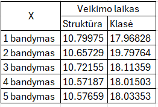
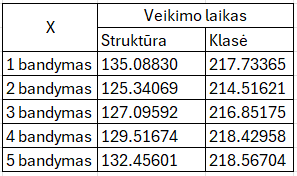
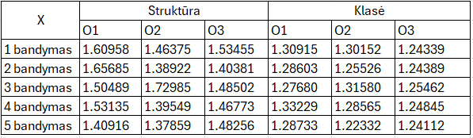
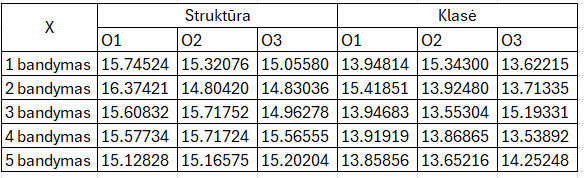

#Studentų galutinio balo apskaičiavimo programa. (v1.1 versija) 

**#v1.1 verisjos tikslas -  Iki šiol naudotą struktūros(struct) realizaciją į klasės(class) realizaciją. Palyginti abiejų programų(v0.1 su struktūromis ir v1.1 su klasėmis) veikimo spartą, naudojant vieną fiksuotą konteinerį, pačią greičiausią dalijimo strategiją ir pasirinkto dydžio failus.**

#Ši programa skirta apskaičiuoti galutiniams balams, įvedant arba nuskaitant iš failo studento vardą, pavardę, namų darbų rezultatus bei egzamino balą.

#Galutinis balas skaičiuojamas tokia formule: **Galutinis = 0.4 * vidurkis + 0.6 * egzaminas** (Kai reikia galutinio balo medianos pavidalu tai tiesiog vietoj vidurkio įstatoma mediana)

**#Norint naudotis programa, reikia atlikti šiuos veiksmus:**
- Pasirinkti, ar norite sugeneruoti failus(taip/ne).

Jei pasirinksite, kad norite sugeneruoti, tuomet failai bus sukurti ir išvedime bus rodomas failų kūrimo laikas.
  
- Atsakyti programai, ar norite įvesti studentų duomenis ar nuskaityti juos iš failo(ivesti/nuskaityti).
- Pasirinkti dalijimo į dvi kategorijas strategiją (1 - pirmoji, 2 - antroji, 3 - trečioji).
- Pasirinkti norimo naudoti konteinerio tipą (1 - vector, 2 - list).
- Pasirinkti rūšiavimo kritetijų (1 - pagal vardą, 2 - pagal pavardę, 3 - pagal galutinį balą).
  
Jei pasirenkate nuskaityti, tai programa tiesiogiai nuskaitys failą, naudodama pasirinktą konteinerio tipą, surušiuos studentus pagal galutinį balą(pagal vidurkį) į dvi grupes:Vargšiukai(galutinis balas < 5) ir Kietiakiai(galutinis balas >= 5), surušiuos pagal pasirinktą kriterijų ir išves į du naujus failus. 
  
  **Jei pasirenkate įvesti, tuomet toliau reikes atlikti šiuos veiksmus:**
- Įvesti studentų skaičių.
- Pasirinkti norimą naudoti konteinerį.
- Įvesti studento vardą ir pavardę.
- Pasirinkti ar namų darbų ir egzamino rezultatus reikia generuoti atsitiktinai(taip/ne).
- Atsakyti programai, ar žinai koks yra namų darbų skaičius(taip/ne).
- Įvesti namų darbų skaičių.
- Įvesti namų darbų visus rezultatus(10-balėje sistemoje).
- Galiausiai įvesti egzamino balą.
Išvedime prie studento duomenų matysite ir objekto saugojimo atmintyje adresą.

**#Palyginamos abiejų programų(versija v1.0 su struktūromis ir v1.1 su klasėmis) veikimo sparta**

#Naudojamas vienas fiksuotas konteineris - vektorius ir pati greičiausia dalijimo strategija - trečioji(su std::partition algoritmu) bei 100000 ir 1000000 dydžio failai.

#100000 įrašų failas

#1000000 įrašų failas

Pastaba. Apskaičiuotas vidutinis veikimo laikas(sekundėmis), kuris leidžia greičiau ir lengviau pastebėti skirtumus, kai naudojamos skirtingos struktūros.
| Įrašų dydis | Struct | Class |
|-------------|--------|-------|
| 100000      | 10s    | 18s   |
| 1000000     | 130s   | 217s  |

Rezultatas: Galima pastebėti, kad naudojant struct tipo duomenis, programos veikimo sparta yra žymiai greitesnė nei naudojant class tipo duomenis. Tai rodo, kad struct yra efektyvesnis tiek mažesniuose, tiek didesniuose duomenų kiekiuose.

**#Toliau atlikita eksperimentinė analizė priklausomai nuo kompiliatoriaus optimizavimo lygio, nurodomo per flag'us: O1, O2, O3.**

Gauti tokie rezultatai:

#100000 įrašų failas

#1000000 įrašų failas

Pastaba. Apskaičiuotas vidutinis veikimo laikas(sekundėmis), kuris leidžia greičiau ir lengviau pastebėti skirtumus, kai naudojamos skirtingos struktūros priklausomai nuo kompiliatoriaus optimizavimo lygio.

| Įrašų dydis | Tipas     | Optimizavimo lygis | Veikimo laikas | .exe failo dydis |
|-------------|-----------|--------------------|----------------|------------------|
| 100000      | struct    | O1                 | 1.54           | 69.5KB           |
| 100000      | struct    | O2                 | 1.47           | 80KB             |
| 100000      | struct    | O3                 | 1.47           | 81KB             |
| 100000      | class     | O1                 | 1.30           | 77.5KB           |
| 100000      | class     | O2                 | 1.28           | 93.5KB           |
| 100000      | class     | O3                 | 1.25           | 94.5KB           |
| 1000000     | struct    | O1                 | 15.69          | 69.5KB           |
| 1000000     | struct    | O2                 | 15.35          | 80KB             |
| 1000000     | struct    | O3                 | 15.12          | 81KB             |
| 1000000     | class     | O1                 | 14.22          | 77.5KB           |
| 1000000     | class     | O2                 | 14.07          | 93.5KB           |
| 1000000     | class     | O3                 | 14.06          | 94.5KB           |

#Paaiškinimai:
- **Optimizavimo lygiai:**:
  - O1 - Pagrindinė optimizacija, kurios tikslas pagerinti programos našumą, nepadidinus jos dydžio per daug.
  - O2 - Aukštesnis optimizavimo lygis, kuris bando pasiekti dar geresnį našumą.
  - O3 - Maksimalus optimizavimas, kuris žymiai pagerina našumą, bet taip pat gali padidinti '.exe' failo dydį.
- **Veikimo laiko matavimas:** Laiko matavimai buvo atlikti su 100000 ir 1000000 įrašų failais.
- **'.exe' failo dydis:**Failo dydžiai priklauso nuo optimizavimo lygio.**
  
  #Rezultatas: Naudojant struct ir class tipus su skirtingais optimizavimo lygiais, matome, kad optimizavimo lygiai turi teigiamą poveikį veikimo laikui. Tačiau patys skirtumai tarp optimizavimo lygių(O1, O2, O3) yra maži ir perėjimas nuo vieno lygio į kitą neturi daug įtakos veikimo laikui. Optimizavimo lygiai turi įtakos ir .exe failo dydžiui. Su struct tipo duomenimis failo dydis pasikeičia nuo 69.5KB(O1) iki 81KB(O3), o su class - failo dydis didėja nuo 77.5KB(O1) iki 94.5KB(O3).

##Išvada: Lyginant su rezultatais is aukščiau nurodytos lentelės, kur nebuvo tikrinami optimizavimo lygiai, matome, kad panaudoju optimizavimo lygius, veikimo laikas sumažėjo, programa pradėjo veikti greičiau.

#Efektyvumo tyrimai ir rezultatai: 
- Laiko efektyvumas:
1. Programa greitai apdoroja nuskaitytus studentų duomenis, tačiau kai yra didesnis studentų skaičius, pastebimas ilgesnis laukimo laikas, kol programa pateikia rezultatus. Galima pamatyti,kad didėjant failo dydžiui, apdorojimo laikas ilgėja, ypač nuskaitymo ir rūšiavimo etapuose. Rūšiavimo laikas augo dramatiškai nuo 0.01251s(1000 įrašų) iki 544.98148s(10000000 įrašų), o dalijimo laikas taip pat didėjo, bet išlieka gerokai greitesnis už rūšiavimo laiką. Bendras testo laikas nuosekliai didėja, atspindėdamas procesų sudėtingumą.
2. Kai buvo pasirinkta įvesti duomenis, tuomet programoje įvedant mažą studentų skaičių(tarkim du), ji apdoroja įvestus studentų duomenis gana greitai. Tačiau kai yra didesnis studentų skaičius(tarkim dešimt), įvedimas užtrunka žymiai ilgiau.
3. Failų kūrimo efektyvumas mažėja didėjant duomenų kiekiui.

Pastaba. Nors kiekvieno testavimo metu rezultatai gali nežymiai skirtis dėl atsitiktinių veiksnių, bendros laiko tendencijos išlieka tos pačios.

- Atminties efektyvumas: programoje naudojamos struktūros std::vector ir std::list, kurios leidžia efektyviai saugoti ir tvarkyti studentų namų darbų rezultatus. Užtikrinama, kad programa galėtų veikti su dideliu studentų skaičiumi.
  
- Vartotojo sąsajos paprastumas: programoje yra leidžiama lengvai įvesti duomenis ir gauti rezultatus. Aiškiai nurodyti visi privalomi įvedimai ir rezultatas gaunamas greitai.

#Rezultatas - Iš įvesties studentų duomenys nuskaitomi teisingai ir programa išveda studentų vardus, pavardes ir galutinį balą(medianos ir vidurkio pavidalu). Taip pat kai nuskaitomas failas, studentai surušiuojami į dvi grupes ir išvedami į naujus failus. Išvedime rodoma programos veikimo greičio analizė. 

##Visų iki šios v1.1 versijos atliktų releasu apibendrinimas:
- 1 ir 2 releasai(v.pradinė ir v0.1) realizuoja programa pagal aprašytus užduoties reikalavimus nuskaito vartotojų įvedamus reikiamus duomenis ir pateikia studentu duomenis.
- 3 releasas(v0.2) - Programa patobulinta, kad generuotu failus, surusiuotu nuskaitytus duomenis ir įrašytų į atskirus failus.
- 4 releasas(v0.3) -  Išmatuojama patobulintos v0.2 realizacijos veikimo spartą priklausomai nuo naudojamo vieno iš dvejų konteinerių(vector ir list)
- 5 releasas(v1.0) - Optimizuota studentų rūšiavimo (dalijimo) į dvi kategorijas ("vargšiukų" ir "kietiakų") realizacija (v0.3)

#Naudotos bibliotekos:
- `<iostream>`
- `<iomanip>`
- `<string>`
- `<vector>`
- `<algorithm>`
- `<random>`
- `<fstream>`
- `<sstream>`
- `<chrono>`
- `<list>`
